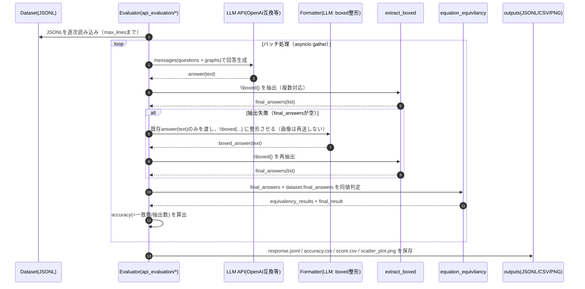

# 基本設計書（現状分析ベース）

## 1. 全体構成

本リポジトリは「**データセット → LLM回答生成 → 最終解抽出 → 同値判定 → 集計**」の評価パイプラインを中心に構成される。

評価の共通部品は次の2つ。

- `extract_boxed.py`: `\boxed{...}` から最終解を抽出
- `equation_equivilancy.py`: SymPy/LLM を用いた同値判定

LLM呼び出し部分は2系統ある。

- **API評価**: `api_evaluation/*.py`（OpenAI互換API / Gemini互換 / Together など）
- **オフライン評価**: `offline_evaluation/*.py`（vLLM想定。ただし現状スクリプトに不整合あり）

## 2. ディレクトリ構造（主要）

- `PHYSICS/`: データセット（JSONL）
  - `PHYSICS-textonly/`: 画像なし版（text-only）
- `api_evaluation/`: API経由で評価するスクリプト群（モデル/手法ごとにファイルが分かれる）
- `offline_evaluation/`: ローカル推論＋評価（想定）スクリプト
- `outputs/`: 既に生成された評価結果（モデル別）

## 3. 処理フロー（API評価）

`api_evaluation/evaluate_gpt4o.py` 等は概ね同じ構造で、モデル名や base_url、プロンプト、追加処理（RAG等）だけが異なる。

### 3.1 シーケンス図（Mermaid）



### 3.2 手法差分（例）

- **Self-Reflect**: 1回目の回答を追加コンテキストとして再度改善させ、改善後の回答からのみ `\boxed{}` を抽出する
- **RAG**: SerpAPIで検索→スニペットを追加して解かせる（`SERPAPI_KEY` が必要）
- **PoT**: ファイル名上の手法表現（中身はプロンプト差分）

## 4. 処理フロー（オフライン評価）

`offline_evaluation/get_answer.py` / `offline_evaluation/evaluation.py` は「ローカル推論→結果JSONL→評価」という2段を意図している。

ただし現状は以下の不整合があるため、**設計としては“意図された流れ”と“実際に outputs/ に存在する形式”を区別**する。

- `get_answer.py` の引数定義が不足しており、そのままだと実行失敗しうる
- `evaluation.py` が参照する `base_output_dir="offline_outputs"` と `dataset_dir="datasets"` が、リポジトリの実体（`outputs/`, `PHYSICS/`）と一致しない

### 4.1 意図されたフロー（Mermaid）

```mermaid
flowchart LR
  D[PHYSICS JSONL] --> A[get_answer.py (vLLM推論)]
  A --> R[response.jsonl(生成結果)]
  R --> E[evaluation.py(評価)]
  D --> E
  E --> F[final_evaluation.jsonl]
  E --> C[accuracy.csv]
```

## 5. 主要コンポーネント設計

### 5.1 `extract_boxed.py`

- `\\boxed{...}` を正規表現で抽出
- 複数 `\\boxed` / ネスト括弧 / `\\[boxed{...}\\]` っぽい表現にも対応

### 5.2 `equation_equivilancy.py`

- SymPy の `parse_latex` → `simplify/expand/trigsimp` を実施
- `simplify(expr1 - expr2) == 0` または `expr1.equals(expr2)` を判定
- `\\text` が入っている/失敗した場合は LLM で同値判定（True/False）
- SymPy計算は `SIGALRM` でタイムアウト保護

## 6. 運用上の注意（現状）

- API評価スクリプトはファイルごとに
  - `base_url`
  - `api_key`
  - `input_jsonl_list`（参照ディレクトリ）
  がバラバラのため、実行前に環境・パス調整が必要
- `PHYSICS/atomic_dataset.jsonl` の `graphs` には **base64画像** が入るため、ログ出力や全文読み込みはトークン/容量に注意


