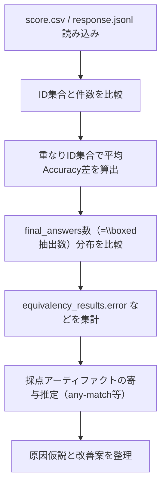

# EDA：GPT-5.2（mechanics）と o3-mini（mechanics_textonly）の精度差要因分析

## 0. 目的（要件定義）

`outputs/gpt-5.2_mechanics_output` と `outputs/o3-mini_together_output` の出力を比較し、**GPT-5.2 の精度が o3-mini より低く見える原因**を、出力ログ（`score.csv`, `response.jsonl`）に基づいて特定する。

### 対象

- GPT-5.2: `outputs/gpt-5.2_mechanics_output/mechanics_dataset/`
- o3-mini: `outputs/o3-mini_together_output/mechanics_dataset_textonly/`

### 成果物

- 同一ID集合での比較（重なり集合）に基づく差分
- 「モデル実力差」vs「採点（抽出/同値判定）由来」の寄与を切り分けるための統計
- 再現手順と、改善案（評価の公平性確保）

---

## 1. 基本設計（分析アーキテクチャ）

### 1.1 参照データ

- **モデル出力**: 各フォルダの `score.csv`, `response.jsonl`, `accuracy.csv`
- **正解データ**（重なり集合の再解釈用）: `PHYSICS/PHYSICS-textonly/mechanics_dataset_textonly.jsonl`

### 1.2 分析フロー（Mermaid）

---

## 2. 詳細設計（指標定義）

### 2.1 既存スコア（現状指標）

評価スクリプト（例: `api_evaluation/evaluate_o3.py`, `api_evaluation/evaluate_mechanics_gpt5_2.py`）は、概ね以下でスコア化している：

- `final_answers`: 回答テキストから `extract_boxed.py` により抽出された **\\boxed の全件**
- `accuracy = 正解数 / 抽出解数`（抽出解数 = len(final_answers)）

この定義の性質上、**途中式まで \\boxed で囲む**モデルは不利になりやすい。

### 2.2 代替指標（採点アーティファクト切り分け用）

- **any-match**: `final_answers` のうち **1つでも** 正解のいずれかに一致したら 1、それ以外 0
  - 目的: 「\\boxed過多による 1/N ペナルティ」を除外した比較

---

## 3. EDA結果（結論に直結する数値）

### 3.1 件数と重なり

- GPT-5.2: **221問**
- o3-mini: **133問**
- 重なり（共通ID）: **133問（o3-miniは 5.2 の部分集合）**

### 3.2 重なり133問での平均Accuracy差（現状指標）

- o3-mini 平均: **0.6090**
- GPT-5.2 平均: **0.4566**
- 差分（5.2 - o3）: **-0.1524**

### 3.3 \\boxed 抽出数（= final_answers数）の違い

- o3-mini: **全133問が final_answers=1**
- GPT-5.2: final_answers が **複数**の問題が多い（最大9）
  - 重なり133問の平均: **1.67**
  - 全221問中、複数抽出: **59問**

典型例（GPT-5.2）:
- 途中のラグランジアンや運動方程式まで `\\boxed{...}` を複数回出力
- 抽出側はそれを **すべて最終解候補として採点**してしまう

### 3.4 any-match 指標での比較（\\boxed過多ペナルティ除外）

重なり133問での any-match 平均：

- o3-mini: **0.6090**（現状指標と同じ。pred=1のため）
- GPT-5.2: **0.5338**

つまり、GPT-5.2 は **\\boxed過多によるペナルティが平均で +0.077 ぶん** 乗っている（`any_match - stored_accuracy ≒ 0.077`）。

それでもなお、any-match でも **o3-mini の方が約0.075高い**ため、
精度差は「採点アーティファクトだけ」では説明しきれず、**実力差（または入力条件差）も残る**。

### 3.5 同値判定エラーの偏り

`response.jsonl` の `equivalency_results.error` の頻度：

- GPT-5.2: **316件 / 874比較**
- o3-mini: **5件 / 208比較**

エラーの最多は `I don't understand this`（LaTeX→SymPy パース失敗）で、以下の要素と共起しやすい：

- `\\text{...}`（単位や注釈）
- `\\approx`（近似記号）
- 小数
- `\\times`

---

## 4. 原因まとめ（「なぜ 5.2 が低く見えるか」）

### 4.1 評価指標が「\\boxed過多」に弱い（構造的要因）

現状は `accuracy = 正解数 / 抽出解数` のため、
GPT-5.2 のように途中式まで `\\boxed` で囲むモデルは、正解が含まれていても **1/N で精度が落ちる**。

### 4.2 同値判定の実装バグ・前処理弱さが 5.2 をより強く罰している（実装要因）

`\\text` を含む回答はパースに失敗しやすく、結果として `final_result=False` になりやすい。
特に GPT-5.2 は単位や注釈を含む形式の最終解を出しやすいため、影響が増幅する。

（※この点は `docs/エラー分析_ANTLR4問題.md` に追記し、`equation_equivilancy.py` の修正を反映済み）

### 4.3 それでも残る差分

any-match でも o3-mini が高い（0.609 vs 0.534）ため、
採点要因を除外しても、**一定の差は残る**。

---

## 5. 改善案（実装計画）

### 5.1 再評価の公平性を上げる（推奨順）

- **プロンプトで強制**: 「最終解のみを最後に1回だけ `\\boxed{...}`。途中式で `\\boxed` を使わない」
- **抽出ロジック改善**（`extract_boxed.py`）:
  - `\\boxed` の全件抽出ではなく、最後の1件のみ採用する等
- **指標見直し**:
  - タスク定義に応じて any-match などへ変更（「解の集合を列挙する」タスクでない限り、precision的な分母は不利になりやすい）

### 5.2 同値判定の堅牢化（コスト/再現性）

- `\\text{}` を含む式は、LLMフォールバックに依存しがち
- 可能なら、単位などを事前に除去する正規化を導入し、`parse_latex` 成功率を上げる

---

## 6. 再現（ローカルでの集計例）

以下の観点で再集計すると、同じ結論に到達できる：

- `score.csv` のID集合と平均差分
- `response.jsonl` の `final_answers` 長さ分布
- `equivalency_results.error` の頻度と内容
- any-match 指標の比較

