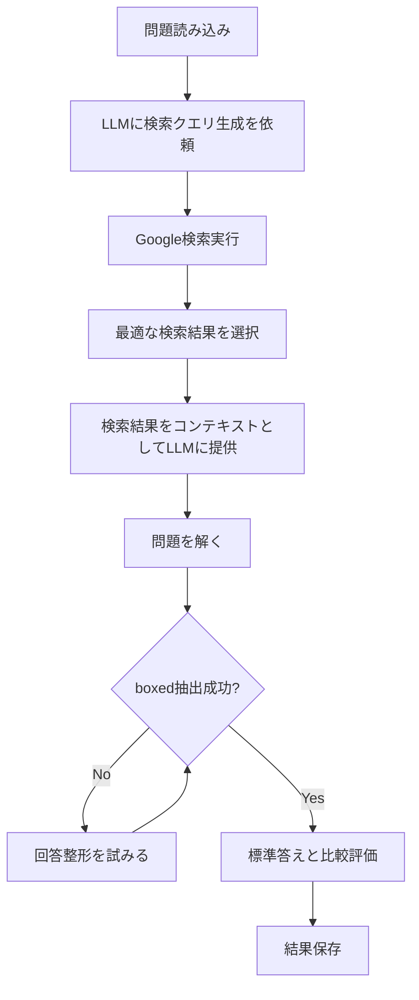

# RAG評価スクリプト（GPT-4o）使用ガイド

## 概要

`evaluate_gpt4o_RAG_v2.py`は、検索結果を活用したRAG（Retrieval-Augmented Generation）方式で物理問題を評価するスクリプトです。Google検索を使用して関連情報を取得し、それをコンテキストとしてLLMに提供することで、より正確な回答を生成します。

## 主な特徴

- **RAG方式**: Google検索結果を活用して問題解決の精度を向上
- **トークン使用量追跡**: 各問題のトークン使用量を記録・分析
- **チェックポイント機能**: 処理途中で中断しても、既存の結果をスキップして再開可能
- **進捗表示**: 詳細な進捗バーで処理状況を可視化
- **エラーハンドリング**: 画像入力時のトークン節約機能（format_attempts）

## 処理フロー



## 必要な環境変数

`.env`ファイルに以下を設定してください：

```env
OPENAI_API_KEY=your_openai_api_key
SERPAPI_KEY=your_serpapi_key  # オプション（デフォルト値あり）
```

## 使用方法

### 基本的な実行

```bash
cd api_evaluation
python evaluate_gpt4o_RAG_v2.py
```

### 設定のカスタマイズ

スクリプト内の`if __name__ == "__main__":`セクションで以下を設定できます：

- `llm`: 使用するLLMモデル（デフォルト: "gpt-4o"）
- `base_output_dir`: 出力先ディレクトリ
- `input_jsonl_list`: 評価するデータセットのリスト
- `max_lines`: 各データセットで評価する最大問題数
- `batch_size`: バッチ処理サイズ
- `skip_existing`: 既存の処理済みIDをスキップするか（True/False）

### 例：力学データセットのみを評価

```python
if __name__ == "__main__":
    script_dir = os.path.dirname(os.path.abspath(__file__))
    project_root = os.path.dirname(script_dir)
    
    llm = "gpt-4o"
    base_output_dir = os.path.join(project_root, "outputs", "gpt-4o_RAG_output")
    
    # 力学データセットのみ
    mechanics_dataset = os.path.join(project_root, "PHYSICS", "mechanics_dataset.jsonl")
    input_jsonl_list = [mechanics_dataset]
    
    max_lines = 221  # 力学データセットは221問
    batch_size = 16
    skip_existing = False
    
    main(llm, base_output_dir, input_jsonl_list, max_lines, batch_size=batch_size, skip_existing=skip_existing)
```

## 出力ファイル

各データセットの出力ディレクトリに以下が生成されます：

- `response.jsonl`: 各問題の詳細な回答と評価結果
- `accuracy.csv`: 全体の精度統計（平均精度、分散、Sympyエラー率、トークン使用量）
- `score.csv`: 各問題の精度とトークン使用量
- `scatter_plot.png`: 精度の散布図

## 主要な関数

### `process_entry()`

各物理問題を処理する関数。以下のパラメータをカスタマイズ可能：

- `solve_attempts`: 問題解決の試行回数（デフォルト: 1）
- `api_retries`: API呼び出しのリトライ回数（デフォルト: 3）
- `format_attempts`: 回答整形の試行回数（デフォルト: 2）
- `format_max_output_tokens`: 整形時の最大出力トークン数（デフォルト: 256）

### `generate_google_query()`

LLMにGoogle検索クエリを生成させる関数。物理問題から最適な検索クエリを生成します。

### `google_search()`

SerpAPIを使用してGoogle検索を実行し、関連するサマリーを返す関数。

## 注意事項

1. **SerpAPIキー**: SerpAPIを使用するため、APIキーが必要です。無料枠には制限があります。
2. **トークンコスト**: RAG方式は検索クエリ生成と検索結果の処理により、通常の評価より多くのトークンを使用します。
3. **処理時間**: 検索処理が追加されるため、処理時間が長くなる可能性があります。
4. **画像入力**: 画像が含まれる問題では、format_attempts機能によりトークン使用量を削減しています。

## トラブルシューティング

### SerpAPIエラー

```
SerpAPI request error for query '...': ...
```

→ `.env`ファイルに`SERPAPI_KEY`が正しく設定されているか確認してください。

### トークン制限エラー

→ `batch_size`を小さくするか、`max_lines`を減らしてください。

### メモリ不足

→ `batch_size`を小さくしてください（推奨: 8-16）。

## 関連ファイル

- `evaluate_mechanics_gpt4o.py`: 基本的な評価スクリプト（参考実装）
- `evaluate_gpt4o_PoT_v2.py`: PoT方式の評価スクリプト
- `evaluate_gpt4o_self_reflect_v2.py`: 自己反省方式の評価スクリプト
