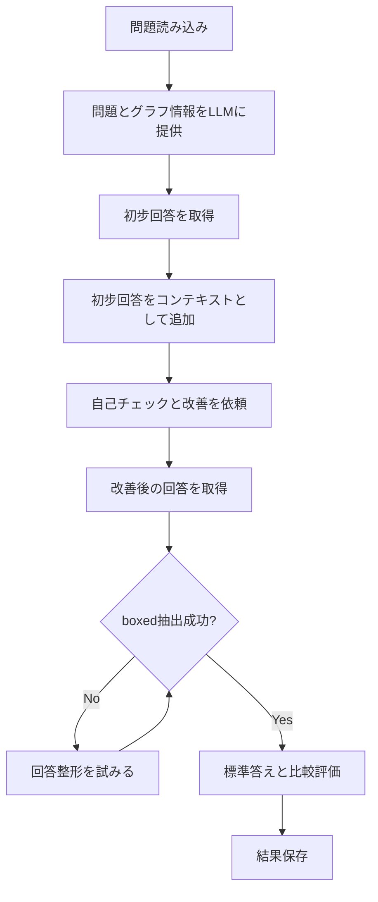

# 自己反省評価スクリプト（GPT-4o）使用ガイド

## 概要

`evaluate_gpt4o_self_reflect_v2.py`は、自己反省（Self-Reflection）方式で物理問題を評価するスクリプトです。まずLLMに問題を解かせ、その回答をコンテキストとして自己チェックと改善を依頼することで、より正確な回答を生成します。

## 主な特徴

- **2段階の自己反省**: 初步回答 → 自己チェック → 改善回答
- **トークン使用量追跡**: 各問題のトークン使用量を記録・分析
- **チェックポイント機能**: 処理途中で中断しても、既存の結果をスキップして再開可能
- **進捗表示**: 詳細な進捗バーで処理状況を可視化
- **エラーハンドリング**: 画像入力時のトークン節約機能（format_attempts）

## 処理フロー



## 必要な環境変数

`.env`ファイルに以下を設定してください：

```env
OPENAI_API_KEY=your_openai_api_key
```

## 使用方法

### 基本的な実行

```bash
cd api_evaluation
python evaluate_gpt4o_self_reflect_v2.py
```

### 設定のカスタマイズ

スクリプト内の`if __name__ == "__main__":`セクションで以下を設定できます：

- `llm`: 使用するLLMモデル（デフォルト: "gpt-4o"）
- `base_output_dir`: 出力先ディレクトリ
- `input_jsonl_list`: 評価するデータセットのリスト
- `max_lines`: 各データセットで評価する最大問題数
- `batch_size`: バッチ処理サイズ
- `skip_existing`: 既存の処理済みIDをスキップするか（True/False）

### 例：力学データセットのみを評価

```python
if __name__ == "__main__":
    script_dir = os.path.dirname(os.path.abspath(__file__))
    project_root = os.path.dirname(script_dir)
    
    llm = "gpt-4o"
    base_output_dir = os.path.join(project_root, "outputs", "gpt-4o_self_reflect_output")
    
    # 力学データセットのみ
    mechanics_dataset = os.path.join(project_root, "PHYSICS", "mechanics_dataset.jsonl")
    input_jsonl_list = [mechanics_dataset]
    
    max_lines = 221  # 力学データセットは221問
    batch_size = 16
    skip_existing = False
    
    main(llm, base_output_dir, input_jsonl_list, max_lines, batch_size=batch_size, skip_existing=skip_existing)
```

## 出力ファイル

各データセットの出力ディレクトリに以下が生成されます：

- `response.jsonl`: 各問題の詳細な回答と評価結果
- `accuracy.csv`: 全体の精度統計（平均精度、分散、Sympyエラー率、トークン使用量）
- `score.csv`: 各問題の精度とトークン使用量
- `scatter_plot.png`: 精度の散布図

## 主要な関数

### `process_entry()`

各物理問題を処理する関数。以下のパラメータをカスタマイズ可能：

- `solve_attempts`: 問題解決の試行回数（デフォルト: 1）
- `api_retries`: API呼び出しのリトライ回数（デフォルト: 3）
- `format_attempts`: 回答整形の試行回数（デフォルト: 2）
- `format_max_output_tokens`: 整形時の最大出力トークン数（デフォルト: 256）

### 2段階の自己反省プロセス

1. **初步回答の取得**: 通常のプロンプトで問題を解かせる
2. **自己チェックと改善**: 初步回答をコンテキストとして、以下のプロンプトで改善を依頼
   ```
   Please check your previous answer carefully. Identify any mistakes 
   and refine your final answer. Provide the revised answer at the end 
   in Latex boxed format \[\\boxed{}\\].
   ```

## 注意事項

1. **トークンコスト**: 自己反省方式は2回のAPI呼び出し（初步回答 + 改善）により、通常の評価より多くのトークンを使用します。
2. **処理時間**: 2段階の処理により、処理時間が長くなる可能性があります。
3. **画像入力**: 画像が含まれる問題では、format_attempts機能によりトークン使用量を削減しています。
4. **改善の効果**: 自己反省により精度が向上する場合がありますが、必ずしも改善されるとは限りません。

## トラブルシューティング

### トークン制限エラー

→ `batch_size`を小さくするか、`max_lines`を減らしてください。

### メモリ不足

→ `batch_size`を小さくしてください（推奨: 8-16）。

### 処理が遅い

→ `batch_size`を調整するか、`solve_attempts`を減らしてください。

### 改善が期待通りでない

→ システムプロンプトや自己チェックのプロンプトを調整してください。

## 関連ファイル

- `evaluate_mechanics_gpt4o.py`: 基本的な評価スクリプト（参考実装）
- `evaluate_gpt4o_RAG_v2.py`: RAG方式の評価スクリプト
- `evaluate_gpt4o_PoT_v2.py`: PoT方式の評価スクリプト

## 比較：3つの評価方式

| 方式 | 特徴 | トークンコスト | 処理時間 | 精度向上の可能性 |
|------|------|---------------|---------|----------------|
| **基本** | シンプルな1回のAPI呼び出し | 低 | 短 | 低 |
| **PoT** | 各ステップで自己反省 | 中 | 中 | 中 |
| **Self-Reflect** | 2段階の自己反省 | 高 | 長 | 高 |
| **RAG** | 検索結果を活用 | 高 | 長 | 高（検索結果の質に依存） |
