# LLM評価フロー説明

## 現状の評価フロー概要

本プロジェクトでは、物理問題データセットに対してLLMに問題を解かせ、その回答を自動評価するパイプラインを実装しています。

## 1. 全体フロー図

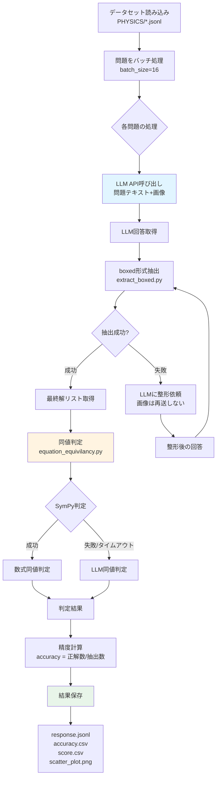

## 2. 詳細な処理ステップ

### 2.1 データセット読み込み

- **入力**: `PHYSICS/*.jsonl` ファイル（1行=1問）
- **データ構造**:
  - `id`: 問題ID
  - `questions`: 問題文（テキスト）
  - `graphs`: 画像データ（base64エンコード、オプション）
  - `final_answers`: 正解リスト

### 2.2 LLM呼び出し

**基本フロー** (`evaluate_gpt4o.py`, `evaluate_mechanics_gpt4o.py`):

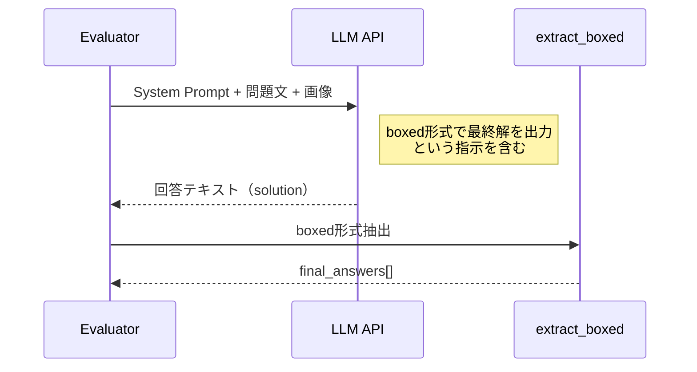

**プロンプト例**:
```
You are an AI expert specializing in answering advanced physics questions. 
Think step by step and provide solution and final answer. 
Provide the final answer at the end in Latex boxed format \[\\boxed{}\]. 
Example: \[ \\boxed{ final_answer} \]
```

### 2.3 最終解抽出（`extract_boxed.py`）

- **目的**: LLMの回答から `\boxed{...}` 形式の最終解を抽出
- **処理**:
  1. 正規表現で `\boxed{...}` を全件抽出
  2. ネストした括弧にも対応
  3. `\boxed{[a,b,c]}` のようなリスト形式も分解可能
- **出力**: 最終解のリスト（抽出失敗時は空リスト）

### 2.4 抽出失敗時のフォールバック（コスト最適化）

`evaluate_mechanics_gpt4o.py` では、画像を含む問題でコスト削減のため、以下の最適化を実装：

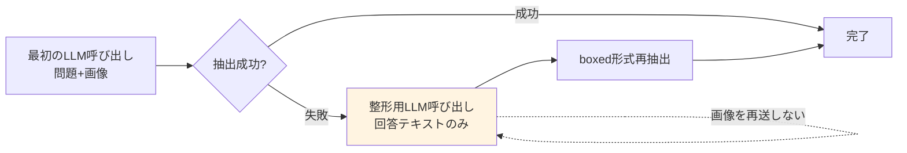

**実装箇所** (`evaluate_mechanics_gpt4o.py` 169-206行目):
- 抽出失敗時、既存の回答テキストのみを渡して整形を依頼
- 画像（base64）を再送しないことで、トークン消費を大幅に削減

### 2.5 同値判定（`equation_equivilancy.py`）

**判定フロー**:

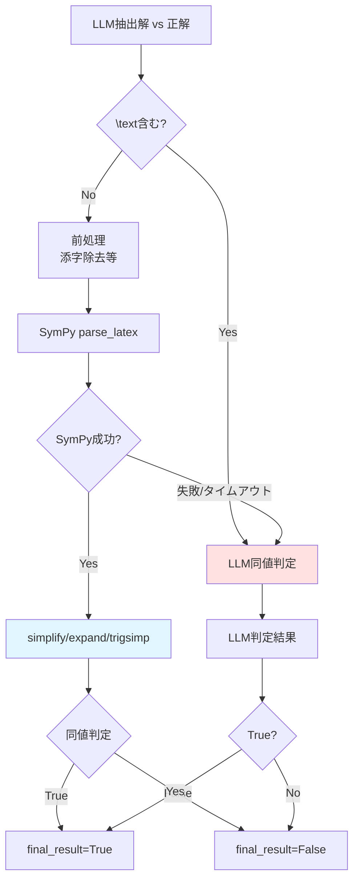

**判定ロジック**:
1. **テキスト混入チェック**: `\text` が含まれる場合はSymPyをスキップしてLLM判定へ
2. **前処理**: 添字除去、`\left`/`\right`除去、`\cdot`→`*`変換など
3. **SymPy判定**: 
   - `parse_latex` でLaTeXをSymPy式に変換
   - `simplify(expr1 - expr2) == 0` または `expr1.equals(expr2)` で判定
   - タイムアウト保護（10秒）
4. **LLMフォールバック**: SymPyが失敗/タイムアウトした場合のみLLMで判定

### 2.6 精度計算

各問題について：
- LLMが抽出した最終解リストを走査
- 各抽出解が、データセットの正解リストのいずれかと一致（`final_result=True`）したら正解としてカウント
- `accuracy = 正解数 / 抽出解数`（抽出解が0の場合は0）

### 2.7 結果保存

以下のファイルが生成されます：

1. **`response.jsonl`**: 各問題の詳細な評価結果
   - `id`: 問題ID
   - `solution`: LLMの生回答
   - `final_answers`: 抽出された最終解リスト
   - `equivalency_results`: 同値判定の詳細ログ
   - `accuracy`: その問題の精度
   - `token_usage`: トークン使用量（取得できた場合）

2. **`accuracy.csv`**: 全体の精度サマリー
   - Overall Accuracy
   - Variance
   - Sympy Error Correct Ratio
   - Token Usage（Total/Average）

3. **`score.csv`**: 各問題の精度スコア
   - Entry ID
   - Accuracy
   - Token Usage（Prompt/Completion/Total）

4. **`scatter_plot.png`**: 精度の散布図
   - 平均値、中央値、標準偏差の線も表示

## 3. 特殊な評価手法

### 3.1 Self-Reflection手法

**フロー** (`evaluate_gpt4o_self_reflect.py` 等):

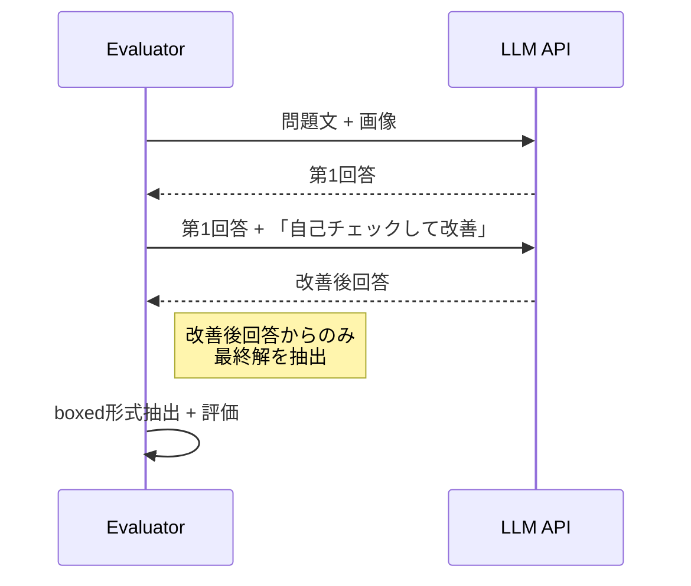

**特徴**:
- 最初の回答を取得後、それをコンテキストとして改善を依頼
- **改善後の回答からのみ**最終解を抽出（最初の回答は評価に使用しない）

### 3.2 RAG手法

**フロー** (`evaluate_gpt4o_RAG.py`):

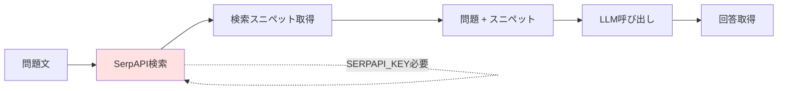

**特徴**:
- Google検索結果を追加コンテキストとして使用
- `SERPAPI_KEY` が必要

### 3.3 PoT (Proof of Thought) 手法

- ファイル名上の表現で、実装はプロンプトの差分のみ

## 4. バッチ処理とチェックポイント

### 4.1 バッチ処理

- **バッチサイズ**: デフォルト16（`batch_size=16`）
- **並列処理**: `asyncio.gather` で並列実行
- **進捗表示**: `tqdm` で進捗バーを表示

### 4.2 チェックポイント機能（`evaluate_mechanics_gpt4o.py`）

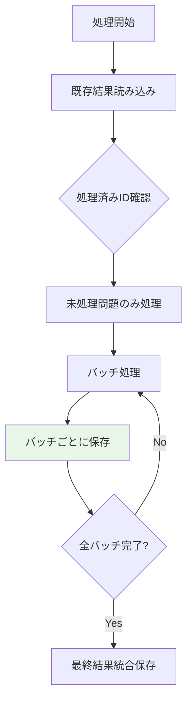

**機能**:
- 既存の `response.jsonl` から処理済み問題IDを読み込み
- 処理済み問題をスキップして再開可能
- バッチ処理後にチェックポイントを保存（途中中断時も安全）

## 5. トークン使用量の最適化

### 5.1 画像再送の回避

- 抽出失敗時、画像を含む巨大入力を再送しない
- 回答テキストのみを渡して整形を依頼

### 5.2 SymPy優先判定

- SymPyで判定可能な場合はLLM判定をスキップ
- LLMフォールバックは `sympy_result=None` の場合のみ

### 5.3 トークン使用量の記録

- 各問題の `token_usage` を記録
- `accuracy.csv` に合計/平均トークン数を出力

## 6. エラーハンドリング

### 6.1 LLM呼び出し失敗

- **リトライ**: 最大3回までリトライ（`max_retries=3`）
- **失敗時**: `solution=None`, `final_answers=[]`, `accuracy=0`

### 6.2 抽出失敗

- **基本**: `final_answers=[]`, `accuracy=0`
- **フォールバック**: 整形用LLM呼び出しを試行（`evaluate_mechanics_gpt4o.py`）

### 6.3 SymPyタイムアウト

- **タイムアウト**: 10秒でタイムアウト
- **フォールバック**: LLM同値判定へ

## 7. 評価スクリプトの種類

| スクリプト | モデル/手法 | 特徴 |
|-----------|------------|------|
| `evaluate_gpt4o.py` | GPT-4o | 基本評価 |
| `evaluate_mechanics_gpt4o.py` | GPT-4o | 力学専用、コスト最適化あり |
| `evaluate_gpt4o_self_reflect.py` | GPT-4o + Self-Reflection | 自己反省で改善 |
| `evaluate_gpt4o_RAG.py` | GPT-4o + RAG | 検索結果を追加コンテキスト |
| `evaluate_gemini_1_5_pro.py` | Gemini-1.5-Pro | Gemini API使用 |
| `evaluate_claude_3_5_sonnet.py` | Claude-3.5-Sonnet | Claude API使用 |
| `evaluate_r1.py` | DeepSeek-R1 | Together AI経由 |

## 8. 実行例

### 8.1 基本評価

```bash
cd api_evaluation
python evaluate_mechanics_gpt4o.py
```

### 8.2 Self-Reflection評価

```bash
cd api_evaluation
python evaluate_gpt4o_self_reflect.py
```

### 8.3 設定変更

各スクリプトの `__main__` 部分で以下を設定：

```python
llm = "gpt-4o"
base_output_dir = "../outputs/gpt-4o_output"
input_jsonl_list = [
    "../PHYSICS/mechanics_dataset.jsonl",
]
max_lines = 221  # 評価する問題数
```

## 9. 結果の確認

### 9.1 全体精度

```bash
cat outputs/gpt-4o_output/mechanics_dataset/accuracy.csv
```

### 9.2 各問題の詳細

```bash
head -n 1 outputs/gpt-4o_output/mechanics_dataset/response.jsonl | python -m json.tool
```

### 9.3 トークン使用量分析

```bash
python tools/analyze_response_fallbacks.py outputs/gpt-4o_mechanics_output/mechanics_dataset/response.jsonl --top 20
```

## 10. evaluate_gpt4o.py と evaluate_mechanics_gpt4o.py の違い

### 10.1 主な違いの比較

| 機能 | evaluate_gpt4o.py | evaluate_mechanics_gpt4o.py |
|------|-------------------|----------------------------|
| **対象データセット** | 全データセット対応 | 力学データセット専用 |
| **抽出失敗時のフォールバック** | ❌ なし（max_retries回リトライのみ） | ✅ あり（画像再送なしで整形依頼） |
| **チェックポイント機能** | ❌ なし | ✅ あり（処理済み問題をスキップ） |
| **トークン使用量記録** | ❌ なし | ✅ あり（各問題の使用量を記録） |
| **CSV出力** | accuracy.csv, score.csv | accuracy.csv（トークン情報含む）, score.csv（トークン情報含む） |
| **進捗表示** | バッチ単位のみ | 問題単位 + バッチ単位 |

### 10.2 処理フローの違い

#### evaluate_gpt4o.py の処理フロー

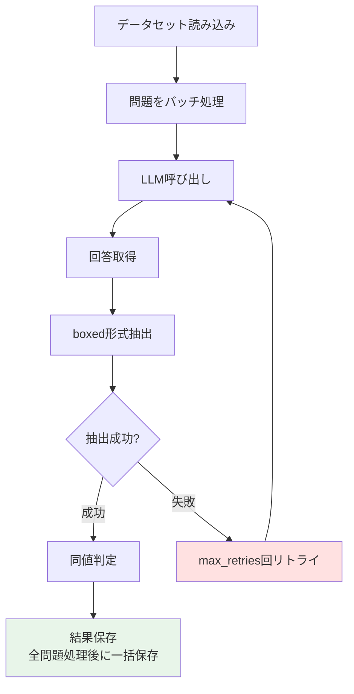

#### evaluate_mechanics_gpt4o.py の処理フロー

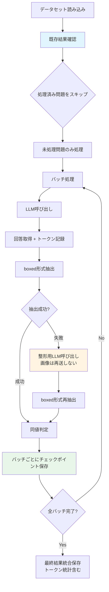

### 10.3 詳細な機能比較

#### 10.3.1 抽出失敗時の処理

**evaluate_gpt4o.py**:
- `max_retries` 回（デフォルト3回）まで、**同じ入力（問題+画像）を再送**してリトライ
- 画像を含む場合、トークン消費が大きい

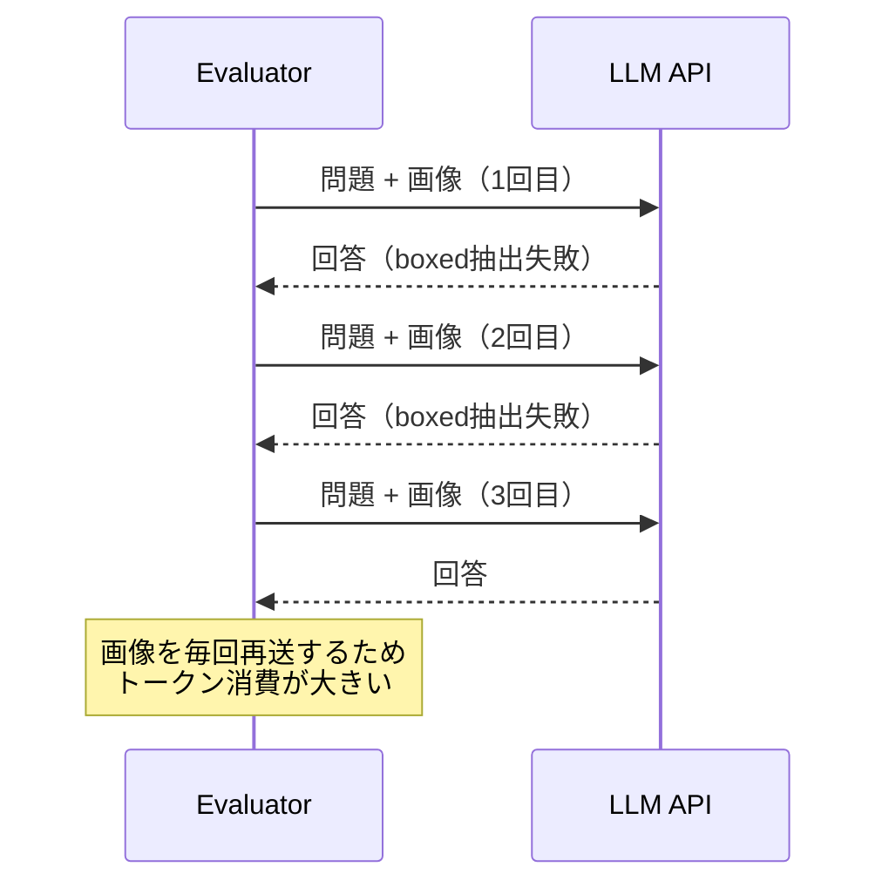

**evaluate_mechanics_gpt4o.py**:
- 最初のLLM呼び出しで回答を取得
- boxed抽出に失敗した場合、**回答テキストのみ**を渡して整形を依頼
- 画像を再送しないため、トークン消費を大幅に削減

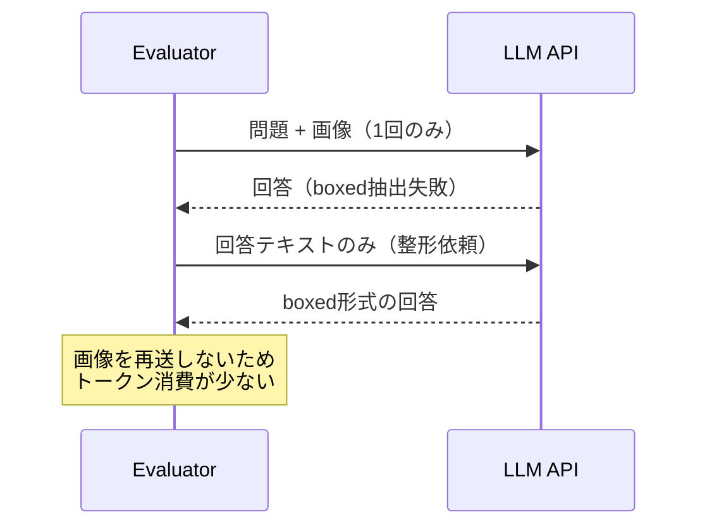

#### 10.3.2 チェックポイント機能

**evaluate_gpt4o.py**:
- チェックポイント機能なし
- 中断した場合、最初から再実行が必要

**evaluate_mechanics_gpt4o.py**:
- `load_processed_ids()`: 既存の `response.jsonl` から処理済み問題IDを読み込み
- `save_checkpoint()`: バッチ処理後に中間結果を保存
- 中断しても、処理済み問題をスキップして再開可能

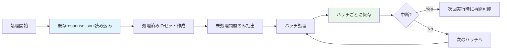

#### 10.3.3 トークン使用量の記録

**evaluate_gpt4o.py**:
- トークン使用量を記録しない
- `ask_llm_with_retries()` は文字列のみを返す

**evaluate_mechanics_gpt4o.py**:
- `LLMCallResult` dataclassで `content` と `usage` を保持
- 各問題の `token_usage` を `response.jsonl` に記録
- `accuracy.csv` に合計/平均トークン数を出力
- `score.csv` に各問題のトークン使用量を出力

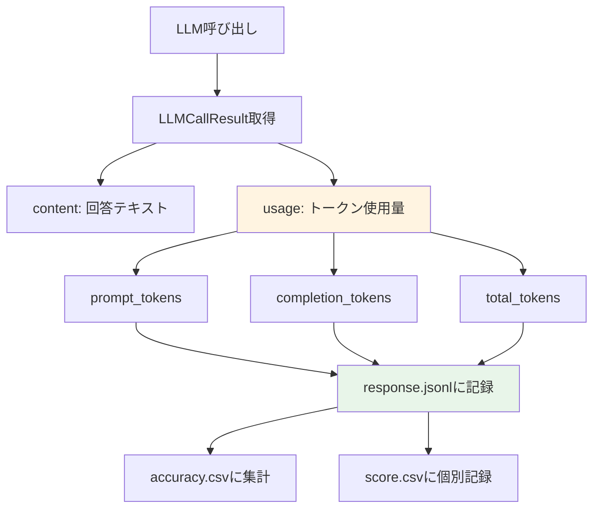

### 10.4 出力ファイルの違い

#### evaluate_gpt4o.py の出力

**accuracy.csv**:
```csv
Overall Accuracy,Variance,Sympy Error Correct Ratio
0.334,0.213,0.013
```

**score.csv**:
```csv
Entry ID,Accuracy
atomic/1-48,1.0
atomic/1-49,0.0
```

#### evaluate_mechanics_gpt4o.py の出力

**accuracy.csv**:
```csv
Overall Accuracy,Variance,Sympy Error Correct Ratio,Total Prompt Tokens,Total Completion Tokens,Total Tokens,Avg Tokens / Problem
0.334,0.213,0.013,1234567,234567,1469134,6647.7
```

**score.csv**:
```csv
Entry ID,Accuracy,Prompt Tokens,Completion Tokens,Total Tokens
mechanics/1-1,1.0,1234,567,1801
mechanics/1-2,0.0,2345,890,3235
```

### 10.5 使用推奨

- **evaluate_gpt4o.py**: 
  - 全データセットを評価する場合
  - シンプルな評価が必要な場合
  - トークン使用量の記録が不要な場合

- **evaluate_mechanics_gpt4o.py**: 
  - 力学データセットのみを評価する場合
  - コスト最適化が必要な場合（画像を含む問題）
  - 長時間実行で中断の可能性がある場合
  - トークン使用量を分析したい場合

## 11. まとめ

現状の評価フローは以下の特徴があります：

1. **モジュール化**: `extract_boxed.py` と `equation_equivilancy.py` が共通部品
2. **コスト最適化**: 画像再送回避、SymPy優先判定
3. **柔軟性**: 複数のモデル/手法に対応
4. **再現性**: チェックポイント機能で途中再開可能（`evaluate_mechanics_gpt4o.py`）
5. **詳細な記録**: 各問題の詳細な評価ログを保存
6. **トークン分析**: トークン使用量の記録と分析が可能（`evaluate_mechanics_gpt4o.py`）